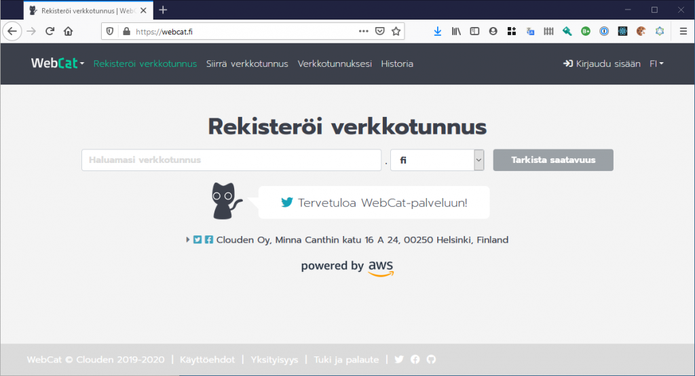
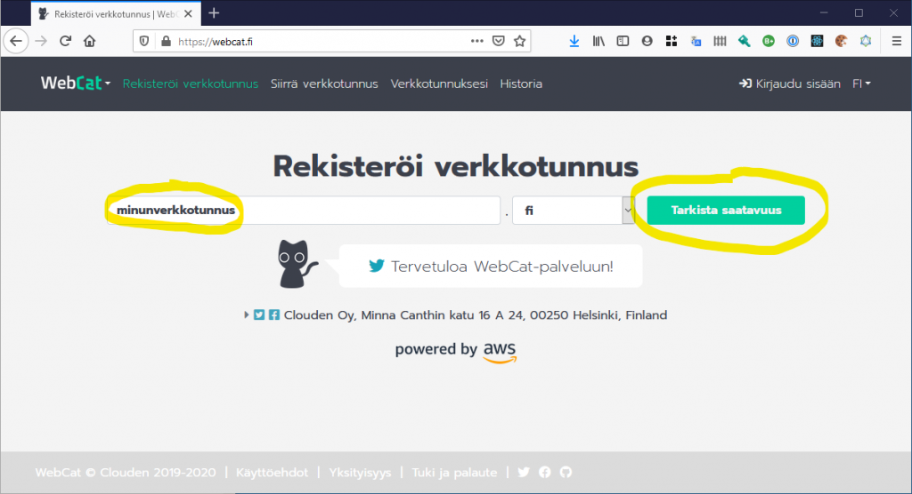
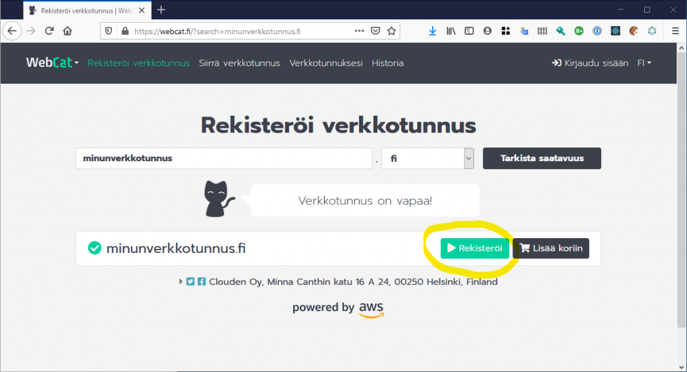
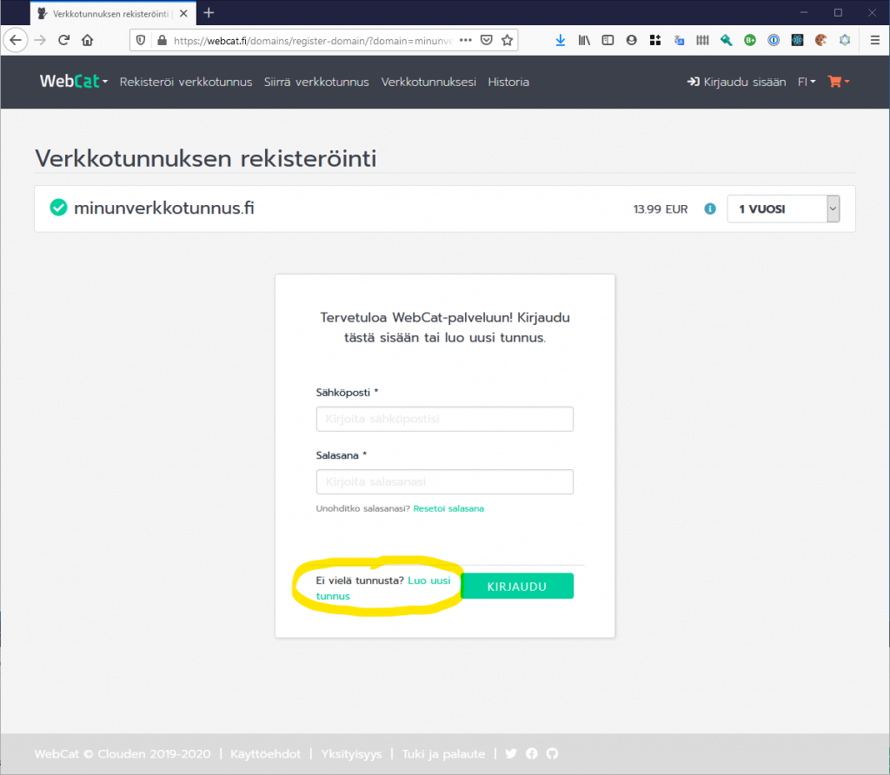
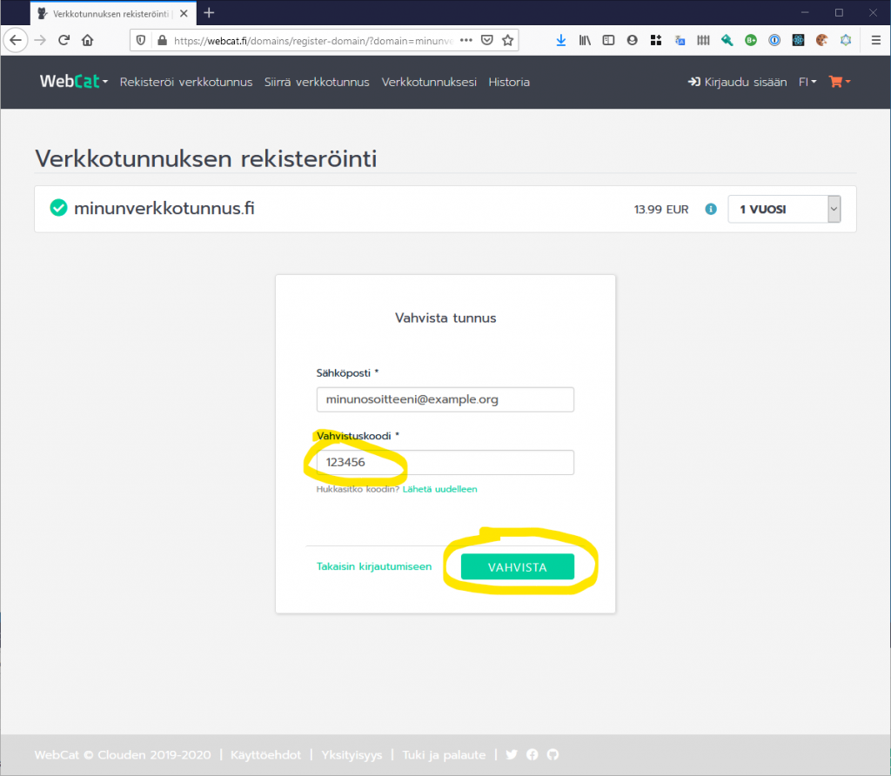
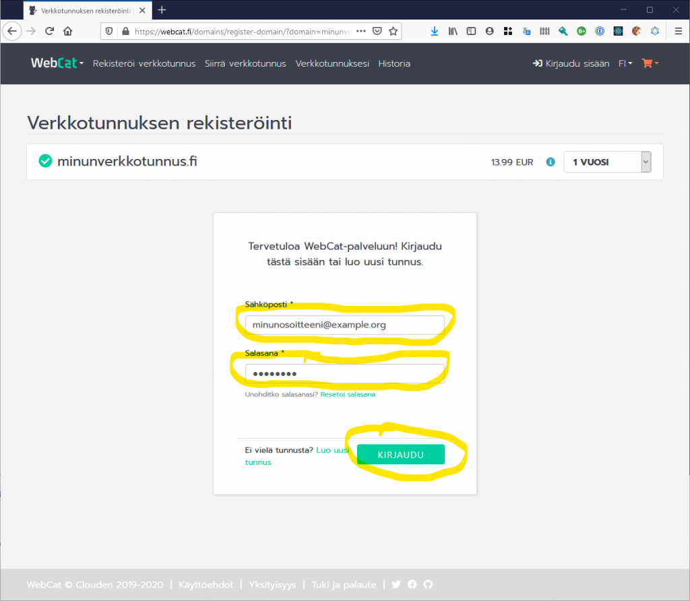
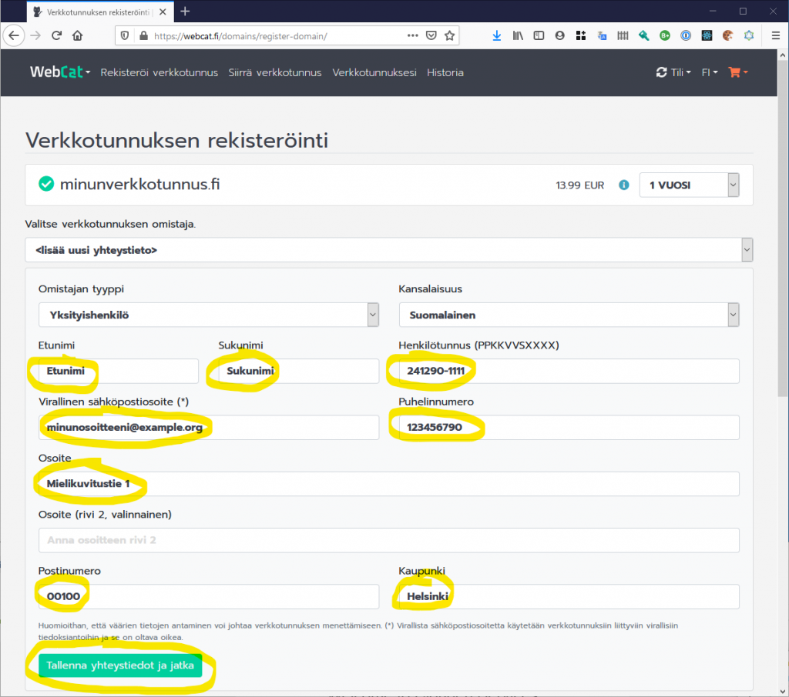
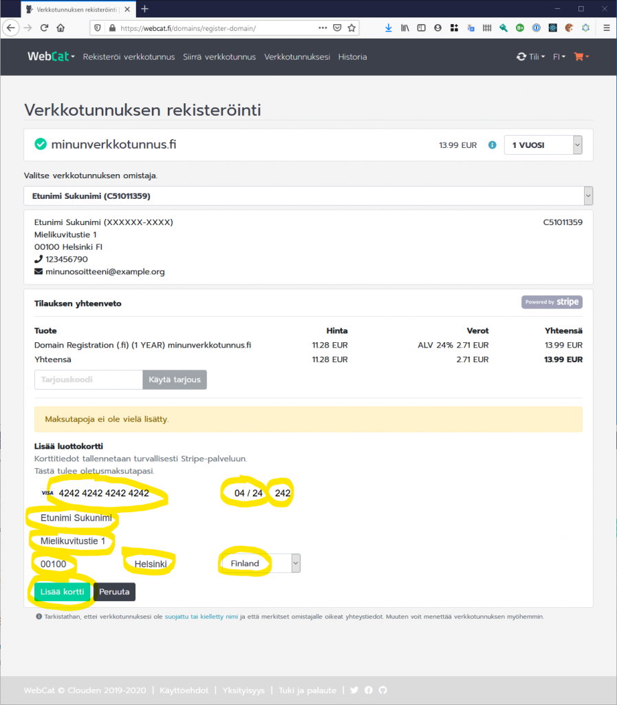
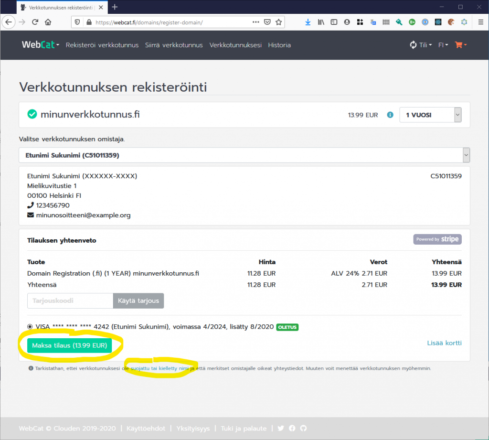

# Uuden verkkotunnuksen rekisteröinti

Tämä artikkeli neuvoo, miten rekisteröit uuden verkkotunnuksen uutena [WebCat](https://webcat.fi)-asiakkaana.

Huomaathan, että kun olet kertaalleen rekisteröinyt henkilötietosi ja maksukorttisi [WebCat](https://webcat.fi)-palveluun, sinun ei tarvitse enää jatkossa antaa niitä uudelleen. Voit silloin hypätä yli kohdat 4-9.

## 1. Avaa [WebCat](https://webcat.fi)-etusivu

Aloita avaamalla etusivumme https://webcat.fi. Tällä sivulla voit tarkistaa onko haluamasi verkkotunnus vapaana.

## 2. Tarkista verkkotunnuksen saatavuus

Kirjoita haluamasi verkkotunnus hakukenttään ja paina Tarkista saatavuus -painiketta.

3. Aloita verkkotunnuksen rekisteröinti

Paina Rekisteröi -painiketta, jos haluat rekisteröidä verkkotunnuksen saman tien. Voit myös käyttää Lisää koriin -painiketta rekisteröidäksesi useamman verkkotunnuksen kerralla.

4. Luo uusi WebCat-tunnus

Uutena asiakkaana sinun on ensin rekisteröidyttävä WebCat-käyttäjäksi painamalla Luo uusi tunnus -painiketta. Jos olet jo WebCat-käyttäjä, voit hypätä kohtaan 7.

5. Anna käyttäjätietosi tunnusta varten

Kirjoita rekisteröitymislomakkeeseen sähköpostiosoitteesi ja valitsemasi salasana. Paina sen jälkeen Luo tunnus -painiketta. WebCat lähettää sähköpostiosoitteeseesi vahvistuskoodin.

6. Vahvista sähköpostiosoitteesi

Kirjoita lomakkeeseen sähköpostitse vastaanottamasi vahvistuskoodi ja paina Vahvista -painiketta.

7. Kirjaudu sisään WebCat-tunnuksellasi

Kirjaudu sisään uudella WebCat-tunnuksellasi antamalla sähköpostiosoitteesi ja salasanasi ja painamalla Kirjaudu-painiketta.

8. Anna verkkotunnuksen omistajan tiedot

Kirjoita yhteystietolomakkeeseen verkkotunnuksen omistajan henkilötiedot ja paina sen jälkeen Tallenna yhteystiedot -painiketta. Näiden yhteystietojen on lain mukaan oltava omistajan oikeat henkilötiedot. Henkilötunnuksesi tallennetaan turvallisesti Traficomin järjestelmään. Jos olet rekisteröimässä verkkotunnusta yritykselle tai yhteisölle, voit vaihtaa omistajan tyyppiä valikosta.

9. Anna maksutiedot

Kirjoita Stripe-maksulomakkeeseen luottokorttisi tiedot. Näitä tietoja käytetään ainoastaan verkkotunnuksen rekisteröinnin maksamiseen. Antamasi luottokortti lisätään oletusmaksutavaksi, jota käytetään jatkossa uusien verkkotunnusten rekisteröintiin ja verkkotunnusten uusimiseen.

10. Vahvista tilaus

Tarkista vielä, ettei haluamasi verkkotunnus ole suojattu tai kielletty nimi. Tarvittaessa saat lisätietoja avaamalla ohjelinkin. Sen jälkeen vahvista tilauksesi painamalla Maksa tilaus -painiketta.

