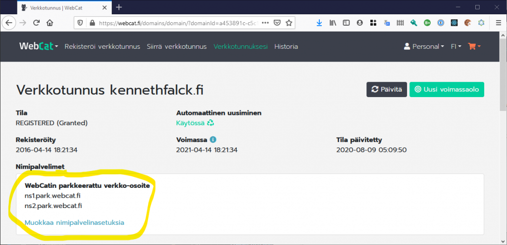
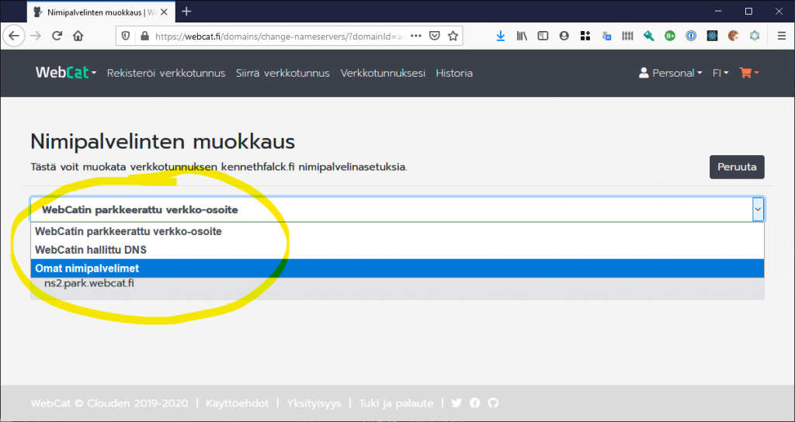
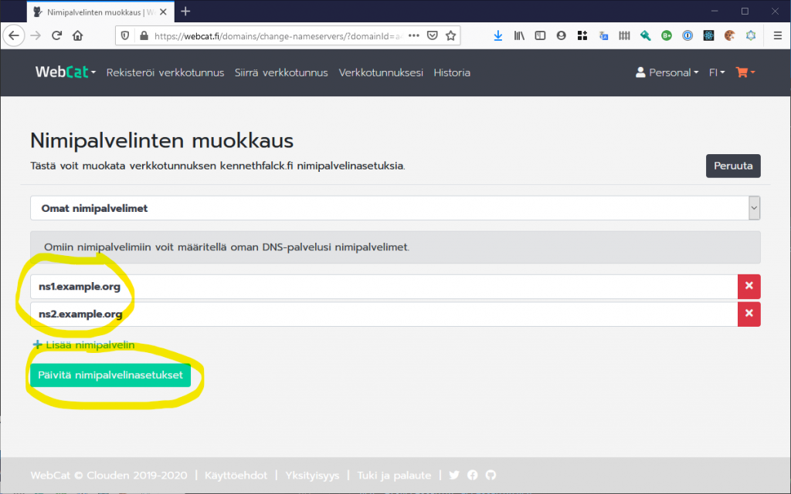

# Verkkotunnuksen nimipalvelinasetukset

Kun rekisteröit uuden verkkotunnuksen, WebCat tekee sille automaattisesti parkkeeratun verkko-osoitteen. Parkkeeratussa verkko-osoitteessa näkyy yksinkertainen oletussivu. Jotta voit ottaa verkkotunnuksen käyttöön muualla, sinun täytyy määritellä verkkotunnukselle oikeat nimipalvelinasetukset. Pääset muokkaamaan verkkotunnuksen nimipalvelinasetuksia *Muokkaa nimipalvelinasetuksia* -painikkeesta.

Jos haluat käyttää omaa nimipalvelinta WebCatin ulkopuolisessa järjestelmässä, valitse asetuksista *Omat nimipalvelimet*.

Kirjoita sen jälkeen nimipalvelimien osoitteet niille varattuihin kenttiin ja paina lopuksi *Päivitä nimipalvelinasetukset* -painiketta ottaaksesi uudet asetukset käyttöön. Huomaa, että nimipalvelimia tarvitaan ainakin kaksi. Halutessasi voit lisätä useampia nimipalvelimia *Lisää nimipalvelin* -painikkeella.

