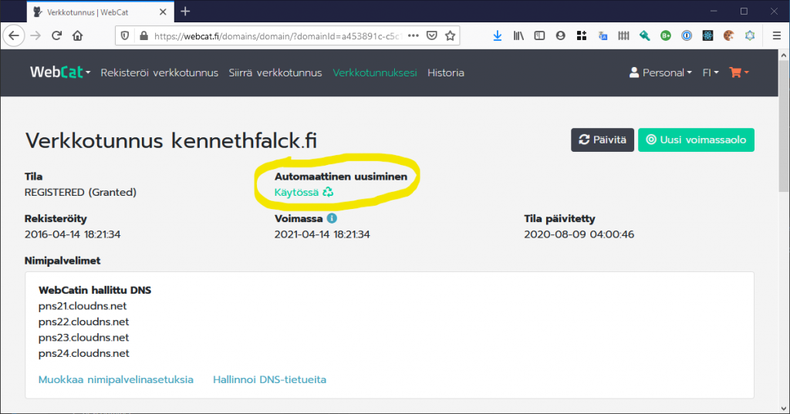
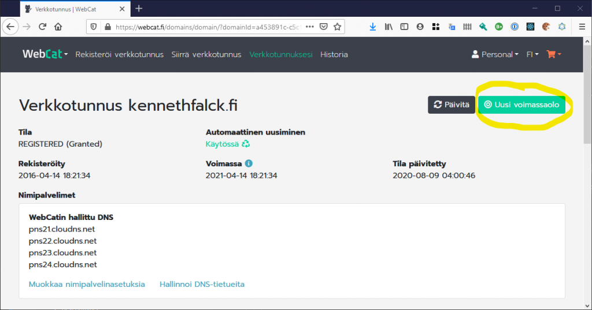

# Verkkotunnuksen uusiminen

WebCat-palvelussa rekisteröidyt verkkotunnukset uusiutuvat automaattisesti vuosittain, jos tiliin on liitetty toimiva maksukortti oletusmaksutavaksi. WebCat uusii verkkotunnuksen automaattisesti kuukautta ennen kuin se vanhenee. Jos uusiminen ei jostain syystä onnistu heti, sitä yritetään uudelleen kuukauden ajan. Saat tästä viestin sähköpostiisi.

## Automaattisen uusimisen estäminen

Jos et halua, että WebCat uusii verkkotunnuksesi automaattisesti vuosittain, voit asettaa automaattisen uusimisen pois päältä verkkotunnuksen asetuksista *Automaattinen uusiminen: Käytössä* -painikkeesta.

## Verkkotunnuksen uusiminen käsin

Voit myös uusia verkkotunnuksen koska tahansa *Uusi voimassaolo* -painikkeesta. Tällöin aukeaa tilausnäkymä, josta voit valita kuinka monella vuodella voimassaoloa jatketaan sekä maksutavan.

