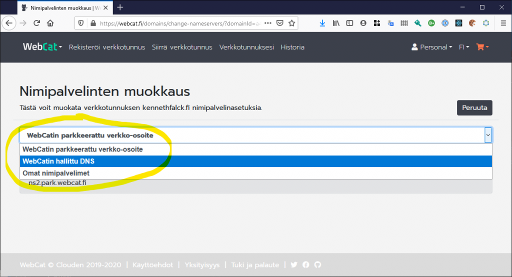
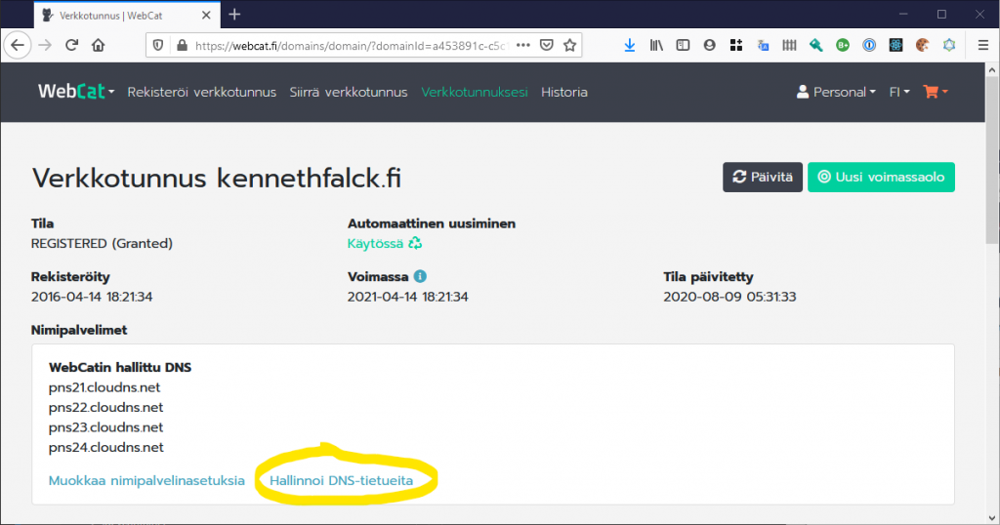

# WebCatin hallitun DNS-nimipalvelun käyttöönotto

WebCatin hallittulla DNS-nimipalvelulla voit hallita verkkotunnuksesi verkko-osoitteita suoraan WebCat-palvelussa ilman erillistä nimipalvelua. Aloita käyttöönotto *Muokkaa nimipalvelinasetuksia* -painikkeella.

Valitse valikosta uudeksi asetukseksi WebCatin hallittu DNS.

Vahvista uudet asetukset *Päivitä nimipalvelinasetukset* -painikkeesta. Huomioi, että hyväksyt samalla ClouDNS-palvelun käyttöehdot.

WebCatin verkkotunnusasetuksiin ilmestyy nyt uusi *Hallinnoi DNS-tietueita* -painike, jolla voit hallita verkkotunnukseen liitettyjä verkko-osoitteita ja muita DNS-tietueita.

